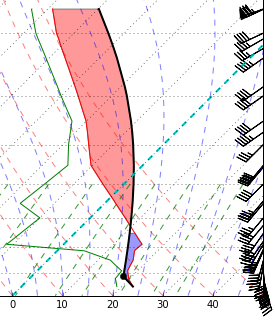
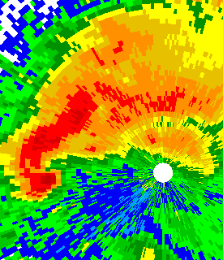

.. MetPy documentation master file, created by
   sphinx-quickstart on Wed Apr 22 15:27:44 2015.
   You can adapt this file completely to your liking, but it should at least
   contain the root `toctree` directive.

.. toctree::
   :maxdepth: 1
   :hidden:

   installguide
   units
   examples/index
   tutorials/index
   api/index
   gempak
   developerguide
   CONTRIBUTING
   citing
   references

=====
MetPy
=====

MetPy is a collection of tools in Python for reading, visualizing, and
performing calculations with weather data.

MetPy is still in an early stage of development, and as such
**no APIs are considered stable.** While we won't break things
just for fun, many things may still change as we work through
design issues.

We support Python 2.7 as well as Python >= 3.4.

----------
Contact Us
----------

* For questions about MetPy, please ask them using the "metpy" tag on StackOverflow_. Our
  developers are actively monitoring for questions there.
* You can also email `Unidata's
  python support email address <mailto: support-python@unidata.ucar.edu>`_
* The source code is available on GitHub_
* Bug reports and feature requests should be directed to the
  `GitHub issue tracker`__
* MetPy has a Gitter_ chatroom for more "live" communication
* MetPy can also be found on Twitter_
* If you use MetPy in a publication, please see :ref:`Citing_MetPy`.
* For release announcements, join Unidata's python-users_ mailing list

.. _python-users: https://www.unidata.ucar.edu/support/#mailinglists
.. _GitHub: https://github.com/Unidata/MetPy
.. _Gitter: https://gitter.im/Unidata/MetPy
.. _Twitter: https://twitter.com/MetPy
.. _StackOverflow: https://stackoverflow.com/questions/tagged/metpy
__ https://github.com/Unidata/MetPy/issues

-----
Media
-----

* Presentation on MetPy and Community Development at the `2018 AMS Annual Meeting`_ by Ryan May
* `SciPy 2017 poster`_ and `repository <https://github.com/jrleeman/CAPE-SciPy-2017>`_
  about reproducing a classic CAPE paper with MetPy.
* `SciPy 2017 talk`_ and `slides
  <http://nbviewer.jupyter.org/format/slides/github/dopplershift/
  Talks/blob/master/SciPy2017/MetPy%20Units.ipynb>`_
  about challenges developing MetPy with units
* MetPy was featured on `Episode 100 of Podcast.__init__`_
* Presentation on MetPy's build infrastructure by Ryan May at `SciPy 2016`_
* MetPy was included in tools presented at the `SSEC/Wisconsin AOS Python Workshop`_
* Presentation on MetPy at the `2016 AMS Annual Meeting`_ by Ryan May
* Ryan May's talk and tutorial on MetPy at the `2015 Unidata Users Workshop`_

.. _`2015 Unidata Users Workshop`: https://www.youtube.com/watch?v=umwauHAL-0M
.. _`2016 AMS Annual Meeting`: https://ams.confex.com/ams/96Annual/webprogram/Paper286983.html
.. _`SSEC/Wisconsin AOS Python Workshop`: https://youtu.be/RRvJI_vouQc
.. _`SciPy 2016`: https://youtu.be/moLKGjbXvgE
.. _`Episode 100 of Podcast.__init__`: https://www.podcastinit.com/episode-100-metpy-with-ryan-may-sean-arms-and-john-leeman/
.. _`SciPy 2017 talk`: https://youtu.be/qCo9bkT9sow
.. _`SciPy 2017 poster`: https://github.com/jrleeman/CAPE-SciPy-2017/blob/master/Poster/SciPy_Poster_2017.pdf
.. _`2018 AMS Annual Meeting`: https://ams.confex.com/ams/98Annual/webprogram/Paper333578.html

-------
License
-------

MetPy is available under the terms of the open source `BSD 3 Clause license`__.

__ https://raw.githubusercontent.com/Unidata/MetPy/master/LICENSE

---------------
Code of Conduct
---------------
We want everyone to feel welcome to contribute to MetPy and participate in discussions. In that
spirit please have a look at our `code of conduct`__.

__ https://github.com/Unidata/MetPy/blob/master/CODE_OF_CONDUCT.md

----------------
Related Projects
----------------

* netCDF4-python_ is the officially blessed Python API for netCDF_
* siphon_ is an API for accessing remote data on `THREDDS Data Server`__
* unidata_python_gallery_ is a collection of meteorological Python scripts

.. _netCDF4-python: https://unidata.github.io/netcdf4-python/
.. _netCDF: https://www.unidata.ucar.edu/software/netcdf/
.. _siphon: https://unidata.github.io/siphon/
.. _unidata_python_gallery: https://unidata.github.io/python-gallery/
__ https://www.unidata.ucar.edu/software/thredds/current/tds/
